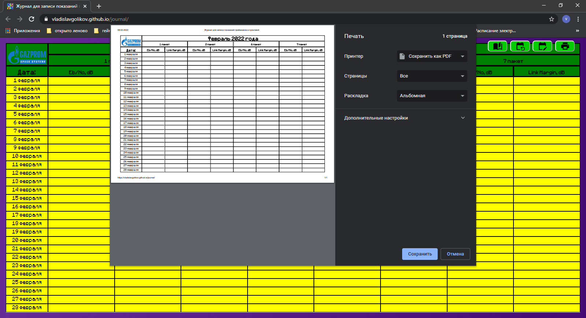

# Универсальный макет для печати оперативных журналов аппаратной телевидения

Этот проект автоматически генерирует макет оперативного журнала и выводит его на печать.
Макет генерируется согласно текущей дате, но дата может быть изменена вручную.
Макет может иметь одну или несколько страниц для печати. Конфигурация и содержимое
таблиц макета находятся в конфигурационном файле в формате
[JSON](https://developer.mozilla.org/ru/docs/Web/JavaScript/Reference/Global_Objects/JSON).

## Приступить к работе

Использовать макет для печати `как есть` возможно двумя способами: либо
[oneline](https://vladislavgolikov.github.io/journal/), либо просто скопировав
содержимое ветки [forpages](https://github.com/VladislavGolikov/journal/tree/forpages)
 настоящего проекта на локальный диск. 
Для использования модифицированного варианта макета следует скопировать на локальный
диск содержимое ветки [master](https://github.com/VladislavGolikov/journal/tree/master).
 Затем сделать соответствующие изменения в структуре и содержимом таблиц в файле
 `config.json`. И далее пересобрать проект, например, в [parcel](https://github.com/parcel-bundler/parcel).

### Зависимости

Готовый проект не имеет никаких зависимостей, для его запуска достаточно любого современного браузера.

## Использование

Макет по умолчанию открывается на первой странице журнала, согласно текущей дате:

при помощи кнопки `листать`    циклически изменяются страницы журнала:

при помощи кнопок `месяц назад`   и `месяц вперед`  
можно изменить текущую дату журнала :

при помощи кнопки `печать`    выбранный макет журнала выводится на печать:

## Версии

Для управления версиями в проекте используется [SemVer](http://semver.org/).
 Доступные версии [здесь](https://github.com/VladislavGolikov/journal/tags).

## Автор

**Владислав Голиков** - [Vladislav Golikov](https://github.com/VladislavGolikov)

## Лицензия

Этот проект находится под лицензией MIT. Подробнее: [LICENSE.md](LICENSE.md)
